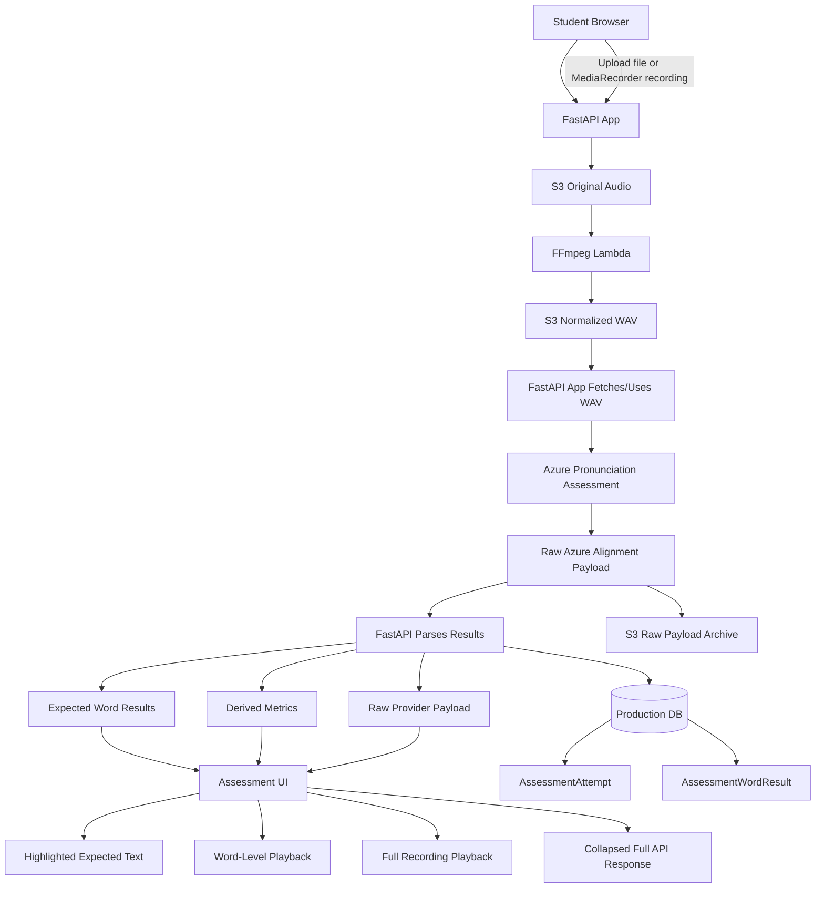
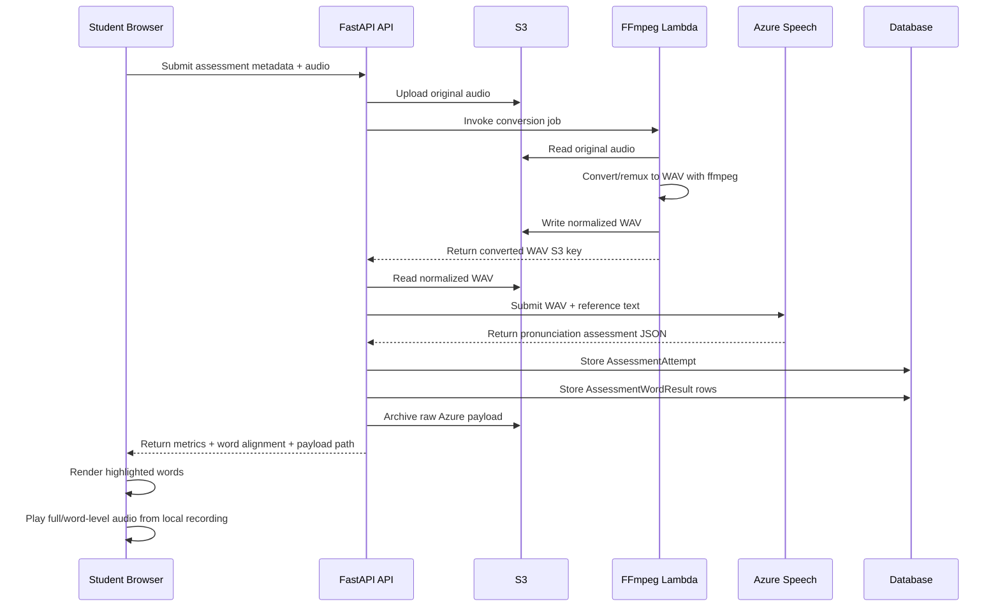

# Production Architecture

## Processing Flow

## Components

- Student Browser: records or uploads student audio.
- FastAPI App: accepts assessment metadata and coordinates processing.
- S3 Original Audio: stores uploaded source audio.
- FFmpeg Lambda: converts browser/uploaded audio to normalized WAV.
- S3 Normalized WAV: stores converted audio for assessment.
- Azure Pronunciation Assessment: returns pronunciation and alignment data.
- Production DB: stores attempt-level and word-level results.
- S3 Raw Payload Archive: stores raw Azure responses for audit/debug.
